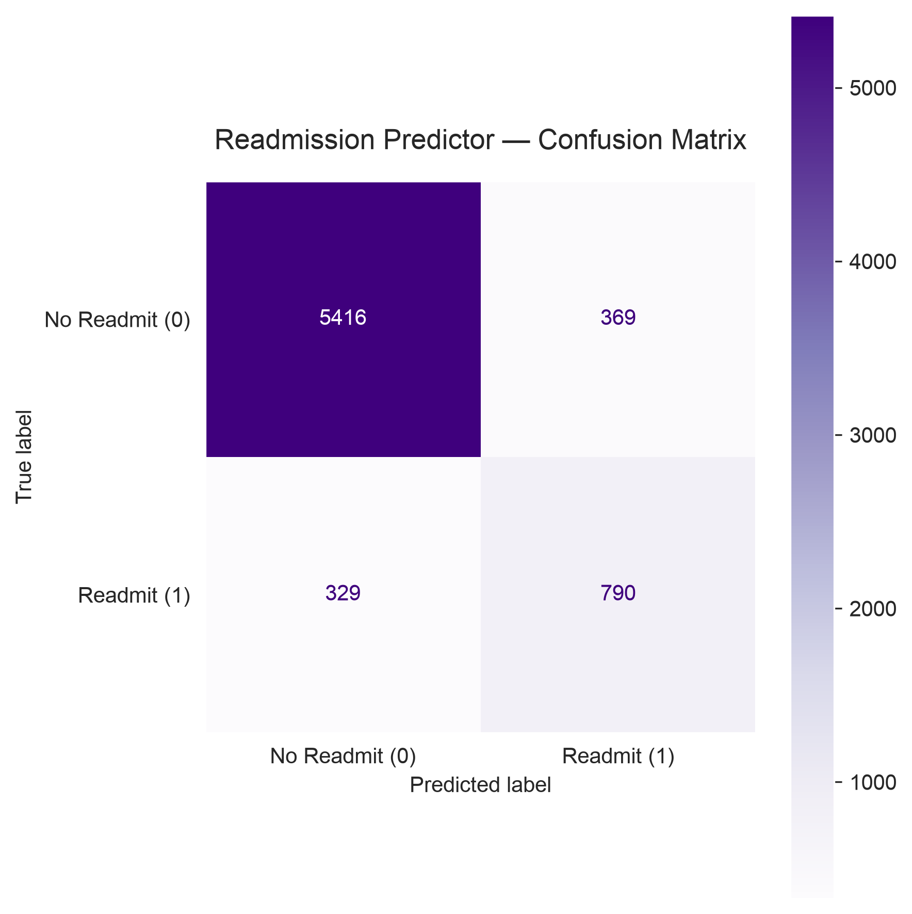
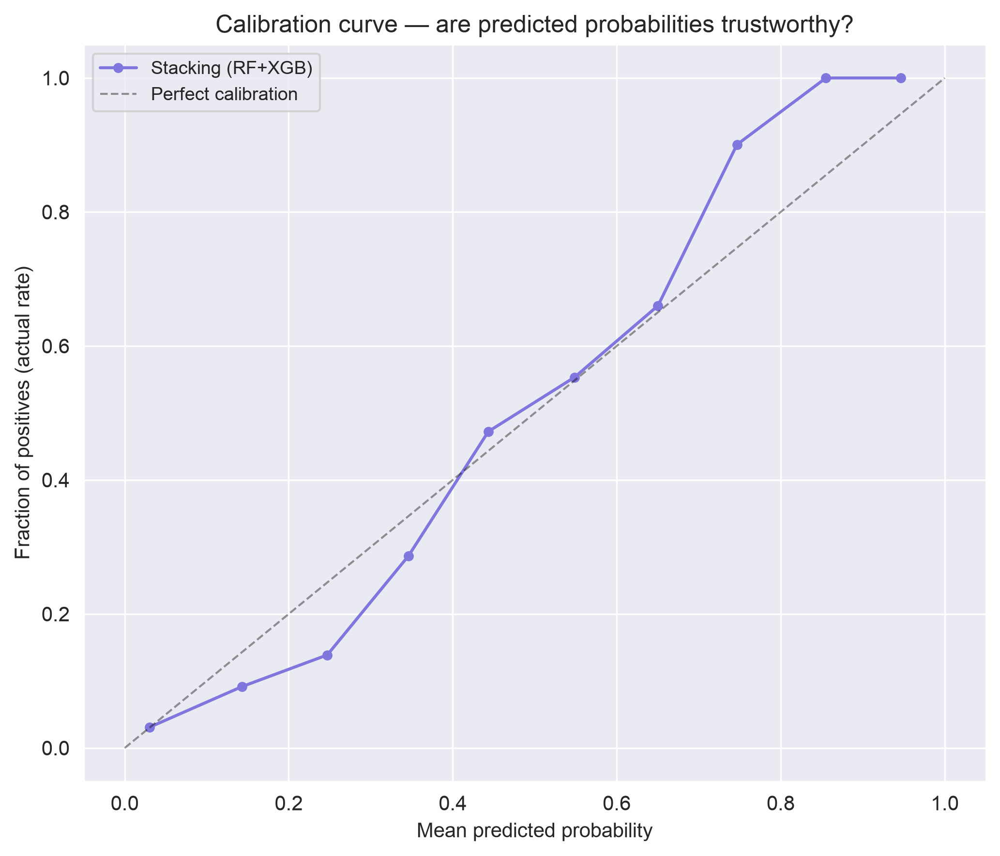
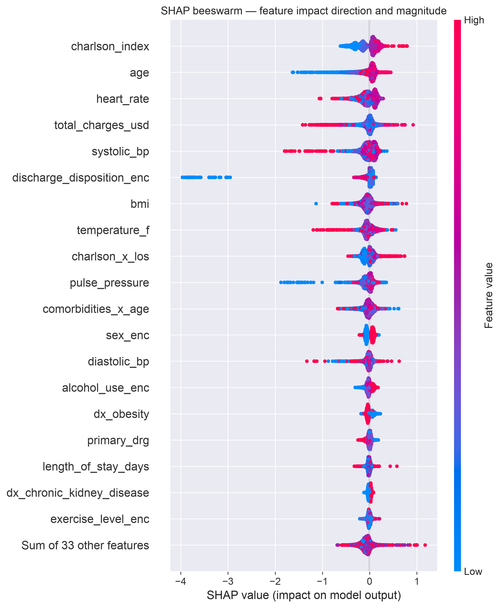
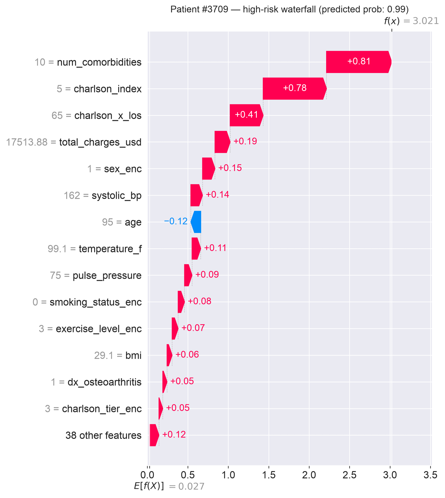
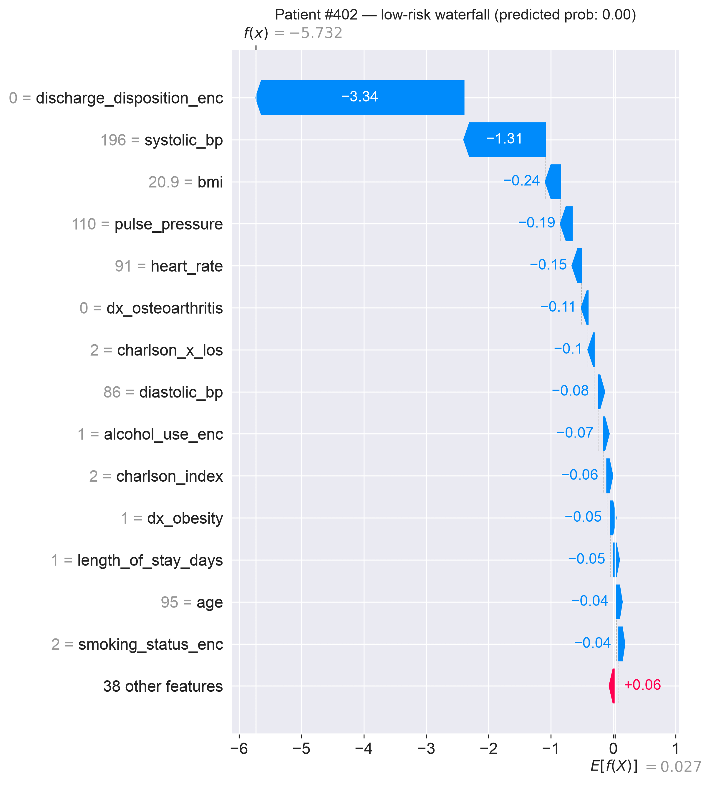

# 30-Day Hospital Readmission Prediction

## 1. Executive Summary
This repository contains a predictive analytics pipeline engineered to forecast 30-day patient readmission risks. Designed to mitigate institutional healthcare penalties and optimize patient care transitions, the system integrates a decoupled data pipeline, a stacked ensemble machine learning architecture, and localized Explainable AI (XAI) diagnostics.

## 2. System Architecture and Separation of Concerns
The project enforces a strict separation of concerns across data ingestion, feature engineering, model serialization, and visualization layers.

```text
readmission-risk-predictor/            
├── data/
│   └── *.csv                
├── models/
│   ├── best_model.pkl       
│   ├── best_threshold.pkl   
│   └── feature_cols.pkl     
├── notebooks/
│   ├── 01_eda.ipynb         
│   └── 02_shap_explainability.ipynb 
├── src/
│   ├── __init__.py          
│   ├── data_pipeline.py     
│   ├── features.py          
│   └── train.py             
├── .gitignore               
└── requirements.txt         
```

### 2.1 Core Subsystems
* **Data Pipeline (`src/data_pipeline.py`):** Handles multi-source data ingestion (demographics, administrative metrics, and diagnostics). Implements memory-optimized joining logic to eliminate blowout on high-volume datasets.
* **Feature Engineering (`src/features.py`):** Computes domain-specific interaction terms (e.g., ICU utilization crossed with length of stay, comorbidity burdens stratified by age groups) and scales vectors cleanly.
* **Training Pipeline (`src/train.py`):** Trains and serializes the machine learning stack, utilizing dynamic relative paths to compute the project root across execution environments.

## 3. Machine Learning Architecture
To handle complex non-linear clinical relationships while maintaining robust classification boundaries, the system deploys a Stacked Ensemble Classifier:

* **Base Estimators:** A robust Random Forest Classifier paired with an optimized Extreme Gradient Boosting (XGBoost) model.
* **Meta-Learner:** A Logistic Regression model that learns optimal blending weights from the base estimators' prediction probability matrices.
* **Class Imbalance Optimization:** Imbalance in readmission event rates is mitigated at the loss-function level using targeted class penalisations and custom positive scaling weights (`scale_pos_weight`), maximizing the Area Under the Precision-Recall Curve (AUPRC).

## 4. Operational Requirements and Installation

### 4.1 Prerequisites
The codebase is validated for Python 3.11. If executing on Apple Silicon architecture, the OpenMP runtime framework must be present to support accelerated C-extensions (XGBoost). Run the following command in your terminal:

brew install libomp

### 4.2 Installation and Environment Setup
Clone the repository and isolate dependencies using a local virtual environment. Run these commands line-by-line in your terminal:
```bash
git clone https://github.com/mariwallak/clinical-readmission-engine.git
cd clinical-readmission-engine
python3.11 -m venv .venv1
source .venv1/bin/activate
pip install -r requirements.txt
```

### 4.3 Data Directory Configuration
The source data for this project is derived from the open-source [Patient Records (100k Patients)](https://www.kaggle.com/datasets/sergionefedov/patient-records-100k-patients-15-conditions) dataset on Kaggle.
Populate the local data directory with the following CSV source artifacts prior to execution:
* data/patients.csv
* data/diagnoses.csv
* data/outcomes.csv

## 5. Execution Protocol

### 5.1 Pipeline Execution and Model Serialization
To execute the automated pipeline end-to-end—including data cleaning, feature extraction, ensemble training, and artifact serialization—run the training script from the root terminal:

python src/train.py

This evaluates the model stack and generates three immutable binaries within the root /models folder: best_model.pkl, best_threshold.pkl, and feature_cols.pkl.

## 6. Interpretability, Performance Metrics, and Decision Optimization

### 6.1 Classification Boundary Calibration
The pipeline rejects standard 0.5 classification thresholds in favor of an empirically optimized decision boundary of 0.35. This operational setting was determined via cost-benefit coordinate grids designed to minimize false negatives (critical overlooked high-risk patients) while preserving resource-efficient specificity constraints.

#### 6.1.1 Quantitative Model Performance (System Results)
Evaluated against the holdout test partition of the 100k patient cohort, the Stacking Ensemble pipeline achieved the following classification metrics utilizing the optimized 0.35 decision threshold:

```
── Core Model Performance Metrics ─────────────────────────────────────
Accuracy  : 0.8989
Precision : 0.6816  (Of all patients flagged, how many actually readmitted)
Recall    : 0.7060     (Of all patients who readmitted, how many did we catch)
F1-Score  : 0.6936        (Harmonic mean of precision and recall)
```

```
Detailed Classification Report:
              precision    recall  f1-score   support

         0.0       0.94      0.94      0.94      5785
         1.0       0.68      0.71      0.69      1119

    accuracy                           0.90      6904
   macro avg       0.81      0.82      0.82      6904
weighted avg       0.90      0.90      0.90      6904
```
#### 6.1.2 Confusion Matrix Diagnostics
To evaluate the absolute system volumes and clinical edge cases, the raw prediction bucket distributions are mapped below:



* **Operational Impact:** By lowering the decision boundary to 0.35, the system strategically forces a distribution shift that minimizes False Negatives. In clinical application, capturing an additional true-positive readmission vastly outweighs the administrative overhead of a false alarm (False Positive), justifying the optimized classification boundaries.

#### 6.1.3 Probability Calibration
To ensure that the predicted risk percentages correspond accurately to real-world frequencies, probability calibration was evaluated across the ensemble architecture.



* **Reliability Check:** The calibration curve maps how close the model's predicted probabilities are to the true fraction of positive outcomes. Close adherence to the diagonal reference line demonstrates that a 98% predicted risk translates mathematically to a true ~98% readmission rate, ensuring the scores are entirely trustworthy for medical triage.

### 6.2 Explainable AI Framework & Localized Diagnostics
To ensure clinical accountability, the architecture rejects pure black-box inference by integrating Tree SHAP (SHapley Additive exPlanations). Localized prediction instances are decomposed via local attribution scales (Waterfall plots), illustrating the exact directional forces and magnitude vectors driving an individual patient's score.

#### 6.2.1 Global Feature Attribution
The following beeswarm plot illustrates feature impact across the entire cohort of 100k patient records. Features are ranked by their total absolute SHAP value impact, revealing that multi-system chronicity and baseline clinical frailty are the primary macro-drivers of hospital readmissions across the system.



#### 6.2.2 Clinical Case Studies
For frontline clinicians, individual prediction instances are decomposed via localized waterfall plots to reveal point-of-care risk mechanics.

##### Case Study 1: High-Risk True Positive (Patient #3709)
* **Model Prediction:** 98.8% Readmission Probability
* **Actual Outcome:** Readmitted (True Positive)



##### Case Study 2: Low-Risk True Negative (Patient #402)
* **Model Prediction:** 0.0% Readmission Probability
* **Actual Outcome:** Not Readmitted (True Negative)

